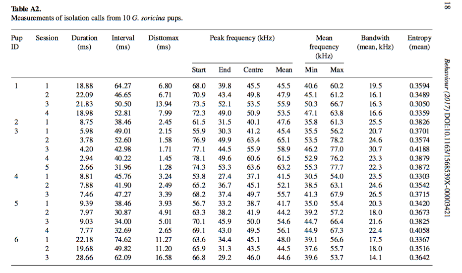
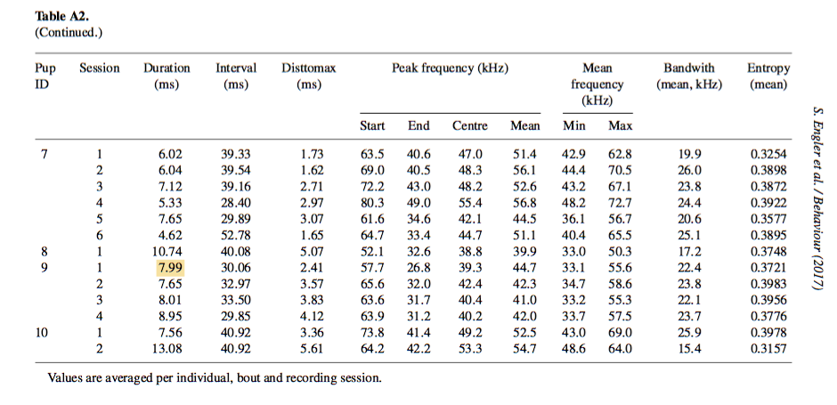
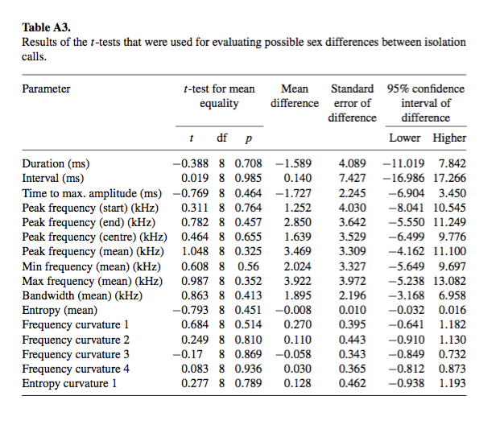
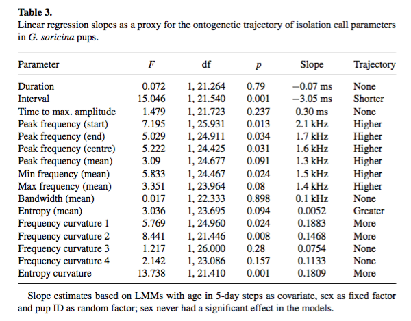

```{r setup, include=FALSE}
knitr::opts_chunk$set(
	echo = TRUE,
	warning = TRUE,
	message = TRUE,
	comment = "##",
	prompt = FALSE,
	tidy = TRUE,
	tidy.opts = list(blank = FALSE, width.cutoff = 75),
	fig.path = "img/",
	fig.align = "center"
)
library(knitr)
library(kableExtra)
```

##Introduction

####I am reanalyzing data from the 2017 Behavior paper "Isolation call ontogeny in bat pups" by Engler et al. (2017). The authors look at the developmental trajectory of isolation call acoustics in the nectivorous bat species Glossophaga soricina. The authors studied 10 individuals in total. They solicited and recorded isolation calls from newborn bats in five day intervals over the first few weeks of life. They then measured a number of acoustic parameters in each calling bout and used a variety of analytical techniques (t-tests, linear mixed models, etc.) to trace how those parameters changed over time. They also used discriminant function analysis to test for an individual signature in the calls. Their results yielded strong support for the existence of such a signature, and showed significant ontogenetic change over time in a variety of acoustic variables. I will be reanalyzing the descriptive statistics, t-tests, and linear mixed  models for this project.

###Engler et al. (2017) Table A2: Descriptive measurements
```{r}
# First I loaded in the raw data and took a quick look at some of the variables
library(readxl)
library(tidyverse)
library(cowplot)
b <- Gsor_IC_PCA_DFA_without_ID_2_8_10_ <- read_excel("Gsor_IC_PCA & DFA(without ID 2,8,10).xlsx")
head(b)


# Then I adjusted units to match those in Table A2 from Engler et al. (2017)
b$duration <- 1000*b$duration
b$interval <- 1000*b$interval
b$disttomax <- 1000*b$disttomax
b$peakfreqstart <- b$peakfreqstart/1000
b$peakfreqend <- b$peakfreqend/1000
b$peakfreqcentre <- b$peakfreqcentre/1000
b$peakfreqmean <- b$peakfreqmean/1000
b$minfreqmean <- b$minfreqmean/1000
b$maxfreqmean  <- b$maxfreqmean/1000
b$bandwmean <- b$bandwmean/1000

# Then I used dplyr to reproduce Table A2
c <- b %>%
  group_by(ID, session) %>%
  summarise_at(vars(duration, interval, disttomax, peakfreqstart, peakfreqend, peakfreqcentre, peakfreqmean, minfreqmean, maxfreqmean, bandwmean, entropymean), funs(mean(., na.rm=TRUE))) %>% 
  select('Pup ID'=1, Session=2, 'Duration (ms)'=3, 'Interval (ms)'=4, 'Disttomax (ms)'=5, 'Peak frequency start (kHz)'=6, 'Peak frequency end (kHz)'=7, 'Peak frequency centre (kHz)'=8, 'Peak frequency mean (kHz)'=9, 'Mean freq Min (kHz)'=10, 'Mean freq Max (kHz)'=11, 'Bandwidth (mean, kHz)'=12, 'Entropy (mean)'=13)
c %>% 
  kable() %>% 
  kable_styling()
```

#### And here is the table from the original paper (split across two images).




###Engler et al. (2017) Table A3: T-tests
```{r}
# T tests
library(readxl)
library(tidyverse)
a <- read_excel("Gsor_IC_t-test_sex diff (all 10 pups).xlsx")

# duration
male <- filter(a, sex=="male")
female <- filter(a, sex=="female")
female$duration <- 1000*female$duration
male$duration <- 1000*male$duration
t_dur <- t.test(female$duration, male$duration, paired=FALSE, var.equal = TRUE)
t_df <- nrow(male) + nrow(female) - 2

mean_dur_m <- mean(male$duration)
mean_dur_f <- mean(female$duration)
means_dur <- c(mean_dur_f, mean_dur_m)
diff.means_dur <- mean_dur_f - mean_dur_m
sd_f <- sd(female$duration)
sd_m <- sd(male$duration)
n_f <- 5
n_m <- 5

var.pooled <- function(df1,df2,SD1,SD2){
  (df1*SD1^2 + df2*SD2^2)/(df1+df2)
}
 
var.pooled_dur <- var.pooled(4, 4, sd(female$duration), sd(male$duration))

SE.diff <- function(var.pool, n1,n2){
  sqrt(var.pool*(1/n1 + 1/n2))
}

SE.diff_dur <- SE.diff(var.pooled_dur, 5, 5)

df_dur <- c((t_dur$statistic), t_df, t_dur$p.value, diff.means_dur, SE.diff_dur, t_dur$conf.int)
df_dur <- matrix(df_dur, ncol=7)
df_dur <- as.data.frame(df_dur)
df_dur <- select(df_dur, t=1, df=2, "p-value"=3, "mean difference"=4, "SE of difference"=5, "95% CI of difference, lower"=6, "95% CI of difference, upper"=7)
row.names(df_dur)[dim(df_dur)[1]] <- "Duration (ms)"
df_dur

# interval

female$interval <- 1000*female$interval
male$interval <- 1000*male$interval
t_int <- t.test(female$interval, male$interval, var.equal = TRUE, paired=FALSE)
t_df <- nrow(male) + nrow(female) - 2

mean_int_m <- mean(male$interval)
mean_int_f <- mean(female$interval)
means_int <- c(mean_int_f, mean_int_m)
diff.means_int <- mean_int_f - mean_int_m

var.pooled <- function(df1,df2,SD1,SD2){
  (df1*SD1^2 + df2*SD2^2)/(df1+df2)
}
 
var.pooled_int <- var.pooled(4, 4, sd(female$interval), sd(male$interval))

SE.diff <- function(var.pool, n1,n2){
  sqrt(var.pool*(1/n1 + 1/n2))
}

SE.diff_int <- SE.diff(var.pooled_int, 5, 5)

df_int <- c((t_int$statistic), t_df, t_int$p.value, diff.means_int, SE.diff_int, t_int$conf.int)
df_int <- matrix(df_int, ncol=7)
df_int <- as.data.frame(df_int)
df_int <- select(df_int, t=1, df=2, "p-value"=3, "mean difference"=4, "SE of difference"=5, "95% CI of difference, lower"=6, "95% CI of difference, upper"=7)
row.names(df_int)[dim(df_int)[1]] <- "Interval (ms)"
df_int

# Time to max. amplitude (ms)

female$disttomax <- 1000*female$disttomax
male$disttomax <- 1000*male$disttomax
t_disttomax <- t.test(female$disttomax, male$disttomax, var.equal = TRUE, paired=FALSE)
t_df <- nrow(male) + nrow(female) - 2

mean_disttomax_m <- mean(male$disttomax)
mean_disttomax_f <- mean(female$disttomax)
means_disttomax <- c(mean_disttomax_f, mean_disttomax_m)
diff.means_disttomax <- mean_disttomax_f - mean_disttomax_m

var.pooled <- function(df1,df2,SD1,SD2){
  (df1*SD1^2 + df2*SD2^2)/(df1+df2)
}
 
var.pooled_disttomax <- var.pooled(4, 4, sd(female$disttomax), sd(male$disttomax))

SE.diff <- function(var.pool, n1,n2){
  sqrt(var.pool*(1/n1 + 1/n2))
}

SE.diff_disttomax <- SE.diff(var.pooled_disttomax, 5, 5)

df_disttomax <- c((t_disttomax$statistic), t_df, t_disttomax$p.value, diff.means_disttomax, SE.diff_disttomax, t_disttomax$conf.int)
df_disttomax <- matrix(df_disttomax, ncol=7)
df_disttomax <- as.data.frame(df_disttomax)
df_disttomax <- select(df_disttomax, t=1, df=2, "p-value"=3, "mean difference"=4, "SE of difference"=5, "95% CI of difference, lower"=6, "95% CI of difference, upper"=7)
row.names(df_disttomax)[dim(df_disttomax)[1]] <- "Time to max. amplitude (ms)"
df_disttomax

# Peak frequency (start) (kHz)
female$peakfreqstart <- female$peakfreqstart/1000
male$peakfreqstart <- male$peakfreqstart/1000
t_peakfreqstart <- t.test(female$peakfreqstart, male$peakfreqstart, paired=FALSE, var.equal = TRUE)
t_df <- nrow(male) + nrow(female) - 2

mean_peakfreqstart_m <- mean(male$peakfreqstart)
mean_peakfreqstart_f <- mean(female$peakfreqstart)
means_peakfreqstart <- c(mean_peakfreqstart_f, mean_peakfreqstart_m)
diff.means_peakfreqstart <- mean_peakfreqstart_f - mean_peakfreqstart_m

var.pooled <- function(df1,df2,SD1,SD2){
  (df1*SD1^2 + df2*SD2^2)/(df1+df2)
}
 
var.pooled_peakfreqstart <- var.pooled(4, 4, sd(female$peakfreqstart), sd(male$peakfreqstart))

SE.diff <- function(var.pool, n1,n2){
  sqrt(var.pool*(1/n1 + 1/n2))
}

SE.diff_peakfreqstart <- SE.diff(var.pooled_peakfreqstart, 5, 5)

df_peakfreqstart <- c((t_peakfreqstart$statistic), t_df, t_peakfreqstart$p.value, diff.means_peakfreqstart, SE.diff_peakfreqstart, t_peakfreqstart$conf.int)
df_peakfreqstart <- matrix(df_peakfreqstart, ncol=7)
df_peakfreqstart <- as.data.frame(df_peakfreqstart)
df_peakfreqstart <- select(df_peakfreqstart, t=1, df=2, "p-value"=3, "mean difference"=4, "SE of difference"=5, "95% CI of difference, lower"=6, "95% CI of difference, upper"=7)
row.names(df_peakfreqstart)[dim(df_peakfreqstart)[1]] <- "Peak frequency (start) (kHz)"
df_peakfreqstart

# Peak freq (end) (kHz)
female$peakfreqend <- female$peakfreqend/1000
male$peakfreqend <- male$peakfreqend/1000
t_peakfreqend <- t.test(female$peakfreqend, male$peakfreqend, paired=FALSE, var.equal = TRUE)
t_df <- nrow(male) + nrow(female) - 2

mean_peakfreqend_m <- mean(male$peakfreqend)
mean_peakfreqend_f <- mean(female$peakfreqend)
means_peakfreqend <- c(mean_peakfreqend_f, mean_peakfreqend_m)
diff.means_peakfreqend <- mean_peakfreqend_f - mean_peakfreqend_m

var.pooled <- function(df1,df2,SD1,SD2){
  (df1*SD1^2 + df2*SD2^2)/(df1+df2)
}
 
var.pooled_peakfreqend <- var.pooled(4, 4, sd(female$peakfreqend), sd(male$peakfreqend))

SE.diff <- function(var.pool, n1,n2){
  sqrt(var.pool*(1/n1 + 1/n2))
}

SE.diff_peakfreqend <- SE.diff(var.pooled_peakfreqend, 5, 5)

df_peakfreqend <- c((t_peakfreqend$statistic), t_df, t_peakfreqend$p.value, diff.means_peakfreqend, SE.diff_peakfreqend, t_peakfreqend$conf.int)
df_peakfreqend <- matrix(df_peakfreqend, ncol=7)
df_peakfreqend <- as.data.frame(df_peakfreqend)
df_peakfreqend <- select(df_peakfreqend, t=1, df=2, "p-value"=3, "mean difference"=4, "SE of difference"=5, "95% CI of difference, lower"=6, "95% CI of difference, upper"=7)
row.names(df_peakfreqend)[dim(df_peakfreqend)[1]] <- "Peak frequency (end) (kHz)"
df_peakfreqend

# Peak frequency (centre) (kHz)

female$peakfreqcentre <- female$peakfreqcentre/1000
male$peakfreqcentre <- male$peakfreqcentre/1000
t_peakfreqcentre <- t.test(female$peakfreqcentre, male$peakfreqcentre, paired=FALSE, var.equal = TRUE)
t_df <- nrow(male) + nrow(female) - 2

mean_peakfreqcentre_m <- mean(male$peakfreqcentre)
mean_peakfreqcentre_f <- mean(female$peakfreqcentre)
means_peakfreqcentre <- c(mean_peakfreqcentre_f, mean_peakfreqcentre_m)
diff.means_peakfreqcentre <- mean_peakfreqcentre_f - mean_peakfreqcentre_m

var.pooled <- function(df1,df2,SD1,SD2){
  (df1*SD1^2 + df2*SD2^2)/(df1+df2)
}
 
var.pooled_peakfreqcentre <- var.pooled(4, 4, sd(female$peakfreqcentre), sd(male$peakfreqcentre))

SE.diff <- function(var.pool, n1,n2){
  sqrt(var.pool*(1/n1 + 1/n2))
}

SE.diff_peakfreqcentre <- SE.diff(var.pooled_peakfreqcentre, 5, 5)

df_peakfreqcentre <- c((t_peakfreqcentre$statistic), t_df, t_peakfreqcentre$p.value, diff.means_peakfreqcentre, SE.diff_peakfreqcentre, t_peakfreqcentre$conf.int)
df_peakfreqcentre <- matrix(df_peakfreqcentre, ncol=7)
df_peakfreqcentre <- as.data.frame(df_peakfreqcentre)
df_peakfreqcentre <- select(df_peakfreqcentre, t=1, df=2, "p-value"=3, "mean difference"=4, "SE of difference"=5, "95% CI of difference, lower"=6, "95% CI of difference, upper"=7)
row.names(df_peakfreqcentre)[dim(df_peakfreqcentre)[1]] <- "Peak frequency (centre) (kHz)"
df_peakfreqcentre

# Peak freqency (mean) (kHz)

female$peakfreqmean <- female$peakfreqmean/1000
male$peakfreqmean <- male$peakfreqmean/1000
t_peakfreqmean <- t.test(female$peakfreqmean, male$peakfreqmean, paired=FALSE, var.equal = TRUE)
t_df <- nrow(male) + nrow(female) - 2

mean_peakfreqmean_m <- mean(male$peakfreqmean)
mean_peakfreqmean_f <- mean(female$peakfreqmean)
means_peakfreqmean <- c(mean_peakfreqmean_f, mean_peakfreqmean_m)
diff.means_peakfreqmean <- mean_peakfreqmean_f - mean_peakfreqmean_m

var.pooled <- function(df1,df2,SD1,SD2){
  (df1*SD1^2 + df2*SD2^2)/(df1+df2)
}
 
var.pooled_peakfreqmean <- var.pooled(4, 4, sd(female$peakfreqmean), sd(male$peakfreqmean))

SE.diff <- function(var.pool, n1,n2){
  sqrt(var.pool*(1/n1 + 1/n2))
}

SE.diff_peakfreqmean <- SE.diff(var.pooled_peakfreqmean, 5, 5)

df_peakfreqmean <- c((t_peakfreqmean$statistic), t_df, t_peakfreqmean$p.value, diff.means_peakfreqmean, SE.diff_peakfreqmean, t_peakfreqmean$conf.int)
df_peakfreqmean <- matrix(df_peakfreqmean, ncol=7)
df_peakfreqmean <- as.data.frame(df_peakfreqmean)
df_peakfreqmean <- select(df_peakfreqmean, t=1, df=2, "p-value"=3, "mean difference"=4, "SE of difference"=5, "95% CI of difference, lower"=6, "95% CI of difference, upper"=7)
row.names(df_peakfreqmean)[dim(df_peakfreqmean)[1]] <- "Peak frequency (mean) (kHz)"
df_peakfreqmean

# Min frequency (mean) (kHz)

female$minfreqmean <- female$minfreqmean/1000
male$minfreqmean <- male$minfreqmean/1000
t_minfreqmean <- t.test(female$minfreqmean, male$minfreqmean, paired=FALSE, var.equal = TRUE)
t_df <- nrow(male) + nrow(female) - 2

mean_minfreqmean_m <- mean(male$minfreqmean)
mean_minfreqmean_f <- mean(female$minfreqmean)
means_minfreqmean <- c(mean_minfreqmean_f, mean_minfreqmean_m)
diff.means_minfreqmean <- mean_minfreqmean_f - mean_minfreqmean_m

var.pooled <- function(df1,df2,SD1,SD2){
  (df1*SD1^2 + df2*SD2^2)/(df1+df2)
}
 
var.pooled_minfreqmean <- var.pooled(4, 4, sd(female$minfreqmean), sd(male$minfreqmean))

SE.diff <- function(var.pool, n1,n2){
  sqrt(var.pool*(1/n1 + 1/n2))
}

SE.diff_minfreqmean <- SE.diff(var.pooled_minfreqmean, 5, 5)

df_minfreqmean <- c((t_minfreqmean$statistic), t_df, t_minfreqmean$p.value, diff.means_minfreqmean, SE.diff_minfreqmean, t_minfreqmean$conf.int)
df_minfreqmean <- matrix(df_minfreqmean, ncol=7)
df_minfreqmean <- as.data.frame(df_minfreqmean)
df_minfreqmean <- select(df_minfreqmean, t=1, df=2, "p-value"=3, "mean difference"=4, "SE of difference"=5, "95% CI of difference, lower"=6, "95% CI of difference, upper"=7)
row.names(df_minfreqmean)[dim(df_minfreqmean)[1]] <- "Min frequency (mean) (kHz)"
df_minfreqmean

# Max frequency (mean) (kHz)

female$maxfreqmean <- female$maxfreqmean/1000
male$maxfreqmean <- male$maxfreqmean/1000
t_maxfreqmean <- t.test(female$maxfreqmean, male$maxfreqmean, paired=FALSE, var.equal = TRUE)
t_df <- nrow(male) + nrow(female) - 2

mean_maxfreqmean_m <- mean(male$maxfreqmean)
mean_maxfreqmean_f <- mean(female$maxfreqmean)
means_maxfreqmean <- c(mean_maxfreqmean_f, mean_maxfreqmean_m)
diff.means_maxfreqmean <- mean_maxfreqmean_f - mean_maxfreqmean_m

var.pooled <- function(df1,df2,SD1,SD2){
  (df1*SD1^2 + df2*SD2^2)/(df1+df2)
}
 
var.pooled_maxfreqmean <- var.pooled(4, 4, sd(female$maxfreqmean), sd(male$maxfreqmean))

SE.diff <- function(var.pool, n1,n2){
  sqrt(var.pool*(1/n1 + 1/n2))
}

SE.diff_maxfreqmean <- SE.diff(var.pooled_maxfreqmean, 5, 5)

df_maxfreqmean <- c((t_maxfreqmean$statistic), t_df, t_maxfreqmean$p.value, diff.means_maxfreqmean, SE.diff_maxfreqmean, t_maxfreqmean$conf.int)
df_maxfreqmean <- matrix(df_maxfreqmean, ncol=7)
df_maxfreqmean <- as.data.frame(df_maxfreqmean)
df_maxfreqmean <- select(df_maxfreqmean, t=1, df=2, "p-value"=3, "mean difference"=4, "SE of difference"=5, "95% CI of difference, lower"=6, "95% CI of difference, upper"=7)
row.names(df_maxfreqmean)[dim(df_maxfreqmean)[1]] <- "Max frequency (mean) (kHz)"
df_maxfreqmean

# Bandwidth (mean) (kHz)

female$bandwmean <- female$bandwmean/1000
male$bandwmean <- male$bandwmean/1000
t_bandwmean <- t.test(female$bandwmean, male$bandwmean, paired=FALSE, var.equal = TRUE)
t_df <- nrow(male) + nrow(female) - 2

mean_bandwmean_m <- mean(male$bandwmean)
mean_bandwmean_f <- mean(female$bandwmean)
means_bandwmean <- c(mean_bandwmean_f, mean_bandwmean_m)
diff.means_bandwmean <- mean_bandwmean_f - mean_bandwmean_m

var.pooled <- function(df1,df2,SD1,SD2){
  (df1*SD1^2 + df2*SD2^2)/(df1+df2)
}
 
var.pooled_bandwmean <- var.pooled(4, 4, sd(female$bandwmean), sd(male$bandwmean))

SE.diff <- function(var.pool, n1,n2){
  sqrt(var.pool*(1/n1 + 1/n2))
}

SE.diff_bandwmean <- SE.diff(var.pooled_bandwmean, 5, 5)

df_bandwmean <- c((t_bandwmean$statistic), t_df, t_bandwmean$p.value, diff.means_bandwmean, SE.diff_bandwmean, t_bandwmean$conf.int)
df_bandwmean <- matrix(df_bandwmean, ncol=7)
df_bandwmean <- as.data.frame(df_bandwmean)
df_bandwmean <- select(df_bandwmean, t=1, df=2, "p-value"=3, "mean difference"=4, "SE of difference"=5, "95% CI of difference, lower"=6, "95% CI of difference, upper"=7)
row.names(df_bandwmean)[dim(df_bandwmean)[1]] <- "Bandwidth (mean) (kHz)"
df_bandwmean

# Entropy (mean)

t_entropymean <- t.test(female$entropymean, male$entropymean, paired=FALSE, var.equal = TRUE)
t_df <- nrow(male) + nrow(female) - 2

mean_entropymean_m <- mean(male$entropymean)
mean_entropymean_f <- mean(female$entropymean)
means_entropymean <- c(mean_entropymean_f, mean_entropymean_m)
diff.means_entropymean <- mean_entropymean_f - mean_entropymean_m

var.pooled <- function(df1,df2,SD1,SD2){
  (df1*SD1^2 + df2*SD2^2)/(df1+df2)
}
 
var.pooled_entropymean <- var.pooled(4, 4, sd(female$entropymean), sd(male$entropymean))

SE.diff <- function(var.pool, n1,n2){
  sqrt(var.pool*(1/n1 + 1/n2))
}

SE.diff_entropymean <- SE.diff(var.pooled_entropymean, 5, 5)

df_entropymean <- c((t_entropymean$statistic), t_df, t_entropymean$p.value, diff.means_entropymean, SE.diff_entropymean, t_entropymean$conf.int)
df_entropymean <- matrix(df_entropymean, ncol=7)
df_entropymean <- as.data.frame(df_entropymean)
df_entropymean <- select(df_entropymean, t=1, df=2, "p-value"=3, "mean difference"=4, "SE of difference"=5, "95% CI of difference, lower"=6, "95% CI of difference, upper"=7)
row.names(df_entropymean)[dim(df_entropymean)[1]] <- "Entropy (mean)"
df_entropymean

# Frequency curvature 1

t_callcurvature1PC1 <- t.test(female$callcurvature1PC1, male$callcurvature1PC1, paired=FALSE, var.equal = TRUE)
t_df <- nrow(male) + nrow(female) - 2

mean_callcurvature1PC1_m <- mean(male$callcurvature1PC1)
mean_callcurvature1PC1_f <- mean(female$callcurvature1PC1)
means_callcurvature1PC1 <- c(mean_callcurvature1PC1_f, mean_callcurvature1PC1_m)
diff.means_callcurvature1PC1 <- mean_callcurvature1PC1_f - mean_callcurvature1PC1_m

var.pooled <- function(df1,df2,SD1,SD2){
  (df1*SD1^2 + df2*SD2^2)/(df1+df2)
}
 
var.pooled_callcurvature1PC1 <- var.pooled(4, 4, sd(female$callcurvature1PC1), sd(male$callcurvature1PC1))

SE.diff <- function(var.pool, n1,n2){
  sqrt(var.pool*(1/n1 + 1/n2))
}

SE.diff_callcurvature1PC1 <- SE.diff(var.pooled_callcurvature1PC1, 5, 5)

df_callcurvature1PC1 <- c((t_callcurvature1PC1$statistic), t_df, t_callcurvature1PC1$p.value, diff.means_callcurvature1PC1, SE.diff_callcurvature1PC1, t_callcurvature1PC1$conf.int)
df_callcurvature1PC1 <- matrix(df_callcurvature1PC1, ncol=7)
df_callcurvature1PC1 <- as.data.frame(df_callcurvature1PC1)
df_callcurvature1PC1 <- select(df_callcurvature1PC1, t=1, df=2, "p-value"=3, "mean difference"=4, "SE of difference"=5, "95% CI of difference, lower"=6, "95% CI of difference, upper"=7)
row.names(df_callcurvature1PC1)[dim(df_callcurvature1PC1)[1]] <- "Frequency curvature 1"
df_callcurvature1PC1

# Frequency curvature 2

t_callcurvature2PC2 <- t.test(female$callcurvature2PC2, male$callcurvature2PC2, paired=FALSE, var.equal = TRUE)
t_df <- nrow(male) + nrow(female) - 2

mean_callcurvature2PC2_m <- mean(male$callcurvature2PC2)
mean_callcurvature2PC2_f <- mean(female$callcurvature2PC2)
means_callcurvature2PC2 <- c(mean_callcurvature2PC2_f, mean_callcurvature2PC2_m)
diff.means_callcurvature2PC2 <- mean_callcurvature2PC2_f - mean_callcurvature2PC2_m

var.pooled <- function(df1,df2,SD1,SD2){
  (df1*SD1^2 + df2*SD2^2)/(df1+df2)
}
 
var.pooled_callcurvature2PC2 <- var.pooled(4, 4, sd(female$callcurvature2PC2), sd(male$callcurvature2PC2))

SE.diff <- function(var.pool, n1,n2){
  sqrt(var.pool*(1/n1 + 1/n2))
}

SE.diff_callcurvature2PC2 <- SE.diff(var.pooled_callcurvature2PC2, 5, 5)

df_callcurvature2PC2 <- c((t_callcurvature2PC2$statistic), t_df, t_callcurvature2PC2$p.value, diff.means_callcurvature2PC2, SE.diff_callcurvature2PC2, t_callcurvature2PC2$conf.int)
df_callcurvature2PC2 <- matrix(df_callcurvature2PC2, ncol=7)
df_callcurvature2PC2 <- as.data.frame(df_callcurvature2PC2)
df_callcurvature2PC2 <- select(df_callcurvature2PC2, t=1, df=2, "p-value"=3, "mean difference"=4, "SE of difference"=5, "95% CI of difference, lower"=6, "95% CI of difference, upper"=7)
row.names(df_callcurvature2PC2)[dim(df_callcurvature2PC2)[1]] <- "Frequency curvature 2"
df_callcurvature2PC2

# Frequency curvature 3

t_callcurvature3PC3 <- t.test(female$callcurvature3PC3, male$callcurvature3PC3, paired=FALSE, var.equal = TRUE)
t_df <- nrow(male) + nrow(female) - 2

mean_callcurvature3PC3_m <- mean(male$callcurvature3PC3)
mean_callcurvature3PC3_f <- mean(female$callcurvature3PC3)
means_callcurvature3PC3 <- c(mean_callcurvature3PC3_f, mean_callcurvature3PC3_m)
diff.means_callcurvature3PC3 <- mean_callcurvature3PC3_f - mean_callcurvature3PC3_m

var.pooled <- function(df1,df2,SD1,SD2){
  (df1*SD1^2 + df2*SD2^2)/(df1+df2)
}
 
var.pooled_callcurvature3PC3 <- var.pooled(4, 4, sd(female$callcurvature3PC3), sd(male$callcurvature3PC3))

SE.diff <- function(var.pool, n1,n2){
  sqrt(var.pool*(1/n1 + 1/n2))
}

SE.diff_callcurvature3PC3 <- SE.diff(var.pooled_callcurvature3PC3, 5, 5)

df_callcurvature3PC3 <- c((t_callcurvature3PC3$statistic), t_df, t_callcurvature3PC3$p.value, diff.means_callcurvature3PC3, SE.diff_callcurvature3PC3, t_callcurvature3PC3$conf.int)
df_callcurvature3PC3 <- matrix(df_callcurvature3PC3, ncol=7)
df_callcurvature3PC3 <- as.data.frame(df_callcurvature3PC3)
df_callcurvature3PC3 <- select(df_callcurvature3PC3, t=1, df=2, "p-value"=3, "mean difference"=4, "SE of difference"=5, "95% CI of difference, lower"=6, "95% CI of difference, upper"=7)
row.names(df_callcurvature3PC3)[dim(df_callcurvature3PC3)[1]] <- "Frequency curvature 3"
df_callcurvature3PC3

# Frequency curvature 4

t_callcurvature4PC4 <- t.test(female$callcurvature4PC4, male$callcurvature4PC4, paired=FALSE, var.equal = TRUE)
t_df <- nrow(male) + nrow(female) - 2

mean_callcurvature4PC4_m <- mean(male$callcurvature4PC4)
mean_callcurvature4PC4_f <- mean(female$callcurvature4PC4)
means_callcurvature4PC4 <- c(mean_callcurvature4PC4_f, mean_callcurvature4PC4_m)
diff.means_callcurvature4PC4 <- mean_callcurvature4PC4_f - mean_callcurvature4PC4_m

var.pooled <- function(df1,df2,SD1,SD2){
  (df1*SD1^2 + df2*SD2^2)/(df1+df2)
}
 
var.pooled_callcurvature4PC4 <- var.pooled(4, 4, sd(female$callcurvature4PC4), sd(male$callcurvature4PC4))

SE.diff <- function(var.pool, n1,n2){
  sqrt(var.pool*(1/n1 + 1/n2))
}

SE.diff_callcurvature4PC4 <- SE.diff(var.pooled_callcurvature4PC4, 5, 5)

df_callcurvature4PC4 <- c((t_callcurvature4PC4$statistic), t_df, t_callcurvature4PC4$p.value, diff.means_callcurvature4PC4, SE.diff_callcurvature4PC4, t_callcurvature4PC4$conf.int)
df_callcurvature4PC4 <- matrix(df_callcurvature4PC4, ncol=7)
df_callcurvature4PC4 <- as.data.frame(df_callcurvature4PC4)
df_callcurvature4PC4 <- select(df_callcurvature4PC4, t=1, df=2, "p-value"=3, "mean difference"=4, "SE of difference"=5, "95% CI of difference, lower"=6, "95% CI of difference, upper"=7)
row.names(df_callcurvature4PC4)[dim(df_callcurvature4PC4)[1]] <- "Frequency curvature 4"
df_callcurvature4PC4

# Entropy curvature 1

t_entropycurvaturePC1 <- t.test(female$entropycurvaturePC1, male$entropycurvaturePC1, paired=FALSE, var.equal = TRUE)
t_df <- nrow(male) + nrow(female) - 2

mean_entropycurvaturePC1_m <- mean(male$entropycurvaturePC1)
mean_entropycurvaturePC1_f <- mean(female$entropycurvaturePC1)
means_entropycurvaturePC1 <- c(mean_entropycurvaturePC1_f, mean_entropycurvaturePC1_m)
diff.means_entropycurvaturePC1 <- mean_entropycurvaturePC1_f - mean_entropycurvaturePC1_m

var.pooled <- function(df1,df2,SD1,SD2){
  (df1*SD1^2 + df2*SD2^2)/(df1+df2)
}
 
var.pooled_entropycurvaturePC1 <- var.pooled(4, 4, sd(female$entropycurvaturePC1), sd(male$entropycurvaturePC1))

SE.diff <- function(var.pool, n1,n2){
  sqrt(var.pool*(1/n1 + 1/n2))
}

SE.diff_entropycurvaturePC1 <- SE.diff(var.pooled_entropycurvaturePC1, 5, 5)

df_entropycurvaturePC1 <- c((t_entropycurvaturePC1$statistic), t_df, t_entropycurvaturePC1$p.value, diff.means_entropycurvaturePC1, SE.diff_entropycurvaturePC1, t_entropycurvaturePC1$conf.int)
df_entropycurvaturePC1 <- matrix(df_entropycurvaturePC1, ncol=7)
df_entropycurvaturePC1 <- as.data.frame(df_entropycurvaturePC1)
df_entropycurvaturePC1 <- select(df_entropycurvaturePC1, t=1, df=2, "p-value"=3, "mean difference"=4, "SE of difference"=5, "95% CI of difference, lower"=6, "95% CI of difference, upper"=7)
row.names(df_entropycurvaturePC1)[dim(df_entropycurvaturePC1)[1]] <- "Entropy curvature 1"
df_entropycurvaturePC1

# table
t_tests <- rbind(df_dur, df_int, df_disttomax, df_peakfreqstart, df_peakfreqend, df_peakfreqcentre, df_peakfreqmean, df_minfreqmean, df_maxfreqmean, df_bandwmean, df_entropymean, df_callcurvature1PC1, df_callcurvature2PC2, df_callcurvature3PC3, df_callcurvature4PC4, df_entropycurvaturePC1)

t_tests %>% 
  kable() %>% 
  kable_styling
```



### Engler et al. (2017) Table 3: Linear Regressions

####These regressions presented some issues. I looked around quite a bit online, but I couldn't find any code that could reproduce the exact values from Table 3 in Engler et al. (2017). I consulted an incoming postdoc in the Ryan lab, and he confirmed that my R code seemed to be correct given the description in the paper. He also ran a version of the model in JMP and got a set of intermediate values between my R-generated ones and the set from the paper. (The authors used SPSS.) One thought I had was that perhaps I should have treated the "covariate" differently than the "fixed factor", but I wasn't able to figure out how to successfully employ that in my code. 

####Barring a few exceptions, the slope directions and orders of magnitude for the other parameters/statics match the paper. But I realize that my results here aren't a true reproduction of this part of the analysis. 

####Below the the main LMM reanalysis, I've included a code chunk that shows how I might have approached the analysis myself. It's based off of ADA Module 21. 

```{r}
# First I load in the linear regression raw data and adjust the units to match those from other analyses.
library(readxl)
library(tidyverse)
b <- read_excel("Gsor_IC_regression_IC ontogeny (without ID 2,8,10).xlsx")
b$sex <- ifelse(b$ID <= 5, 'female', 'male')
b$duration <- 1000*b$duration
b$duration <- 1000*b$duration
b$interval <- 1000*b$interval
b$disttomax <- 1000*b$disttomax
b$peakfreqstart <- b$peakfreqstart/1000
b$peakfreqend <- b$peakfreqend/1000
b$peakfreqcentre <- b$peakfreqcentre/1000
b$peakfreqmean <- b$peakfreqmean/1000
b$minfreqmean <- b$minfreqmean/1000
b$maxfreqmean  <- b$maxfreqmean/1000
b$bandwmean <- b$bandwmean/1000
head(b)

# First I wrote a function that returns all of the regression features reported in Table 3 of Engler et al. (2017)
LMM <- function (x) {
  library(lmerTest)
lmm <- lmer(x ~ session + sex + (1|ID), data = b)
summary(lmm)
coef(summary(lmm))
df <- coef(summary(lmm))[[8]]
p.value <- coef(summary(lmm))[[14]]
slope <- coef(summary(lmm))[[2]]
trajectory1 <- ifelse(p.value<.05 && slope>0, "Greater", ifelse(p.value<.05 && slope<0, "Less", ifelse(p.value>.05, "None")))

anova.lmm <- anova(lmm)
anova.lmm
f <- anova.lmm$`F value`[[1]]

df <- c(f, df, p.value, slope, trajectory1)
df <- matrix(df, ncol=5)
df <- as.data.frame(df)
df <- select(df, 'F'=1, 'df'=2, "p"=3, "Slope"=4, "trajectory1"=5)
df
}

# Then I ran the function for all the acoustic parameters reported in Table 3.
LMMs <- rbind(LMM(b$duration), LMM(b$interval), LMM(b$disttomax), LMM(b$peakfreqstart), LMM(b$peakfreqend), LMM(b$peakfreqcentre), LMM(b$peakfreqmean), LMM(b$minfreqmean), LMM(b$maxfreqmean), LMM(b$bandwmean), LMM(b$entropymean), LMM(b$callcurvature1PC1), LMM(b$callcurvature2PC2), LMM(b$callcurvature3PC3), LMM(b$callcurvature4PC4), LMM(b$entropycurvaturePC1))

# Then I adjusted the cell values in the "Trajectory" column to make sense with the parameters they described.
LMMs <- LMMs %>% mutate(Trajectory = c('None', 'Shorter', 'None', 'Higher','Higher','Higher','Higher','Higher','Higher','None','Greater','More','More','None','None','More'))
LMMs <- LMMs %>% select(-trajectory1)
rownames(LMMs) <- c("Duration", 'Inverval', 'Time to max. amplitude', 'Peak frequency (start)', 'Peak frequency (end)', 'Peak frequency (centre)', 'Peak frequency (mean)', 'Min frequency (mean)', 'Max frequency (mean)', 'Bandwidth (mean)', 'Entropy (mean)', 'Frequency curvature 1', 'Frequency curvature 2', 'Frequency curvature 3', 'Frequency curvature 4', 'Entropy curvature')
# Then I printed my table.
LMMs %>% 
  kable() %>% 
  kable_styling()
```



```{r}
# If I were to do these regressions on my own in R, here is an example of what might be a superior approach, given that it doesn't rely on p-values:
library(lme4)
lme <- lmer(entropymean ~ sex + session + (1|ID), data = b)
summary(lme)
coefficients(lme)

full <- lmer(data = b, entropymean ~ session + sex + (1 | ID), REML = FALSE)
summary(full)
reduced <- lmer(data = b, entropymean ~ session + (1 | ID), REML = FALSE)
summary(reduced)
reduced2 <- lmer(data = b, entropymean ~ sex + (1 | ID), REML = FALSE)

anova(reduced, full, test = "Chisq")
anova(reduced2, full, test = "Chisq")
```

###Summary

#### In general, I was able to reproduce the descriptive statistics and the t-tests from Engler et al. (2017). My results for the LMM portion of the paper were significantly different, however. This could be due to my own mistake, processing differences between SPSS and R, or (least likely given the circumstances), a mistake by the authors. I hope to reproduce an LMM analysis from another paper in the near future so that I can determine which of these options is most likely.

###References

#### Engler, S., Rose, A., & Knörnschild, M. (2017). Isolation call ontogeny in bat pups (Glossophaga soricina). Behaviour, 154(3), 267-286.
